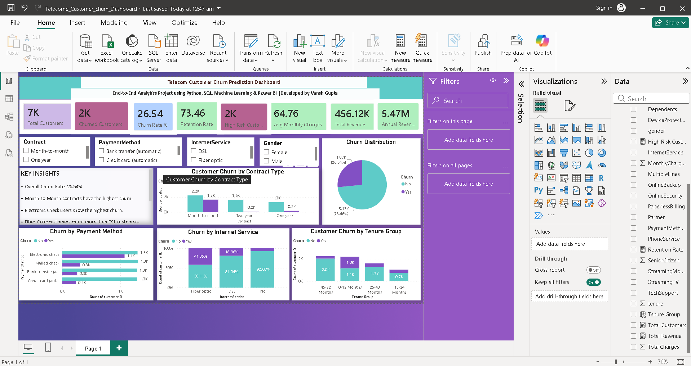
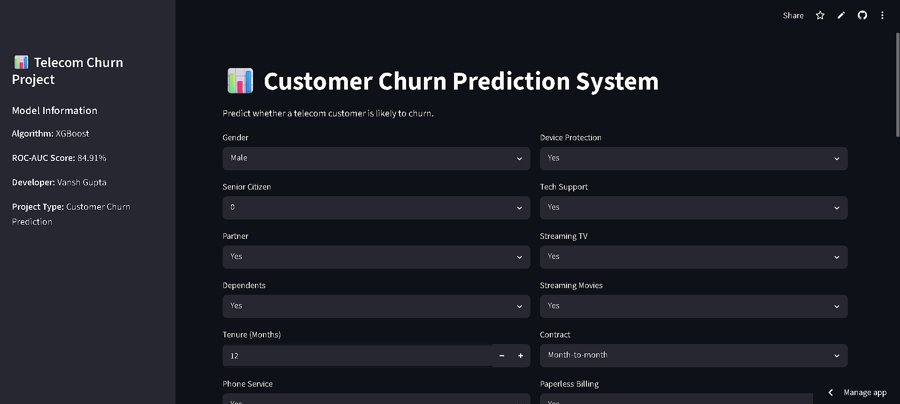
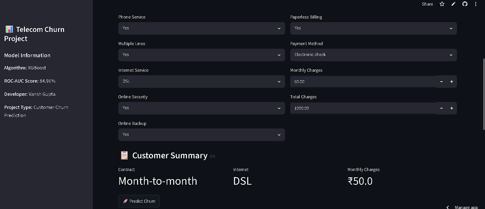

# Telecom Customer Churn Prediction & Business Intelligence System

## Project Overview

This project is an End-to-End Customer Churn Prediction and Business Intelligence solution developed using Python, SQL, Machine Learning, Power BI, and Streamlit.

The objective of this project is to identify customers who are likely to churn, analyze the key factors contributing to churn, and provide actionable business insights through interactive dashboards and predictive analytics.

---

## Problem Statement

Customer churn is one of the biggest challenges faced by telecom companies. Losing customers directly impacts revenue and business growth.

The goal of this project is to:

- Predict whether a customer is likely to churn.
- Identify high-risk customer segments.
- Analyze churn patterns using SQL and Power BI.
- Support data-driven customer retention strategies.

---

## Dataset Information

Dataset: Telco Customer Churn Dataset

Total Customers: 7,043

## Dataset Features

### Customer Information
- gender
- SeniorCitizen
- Partner
- Dependents

### Service Information
- PhoneService
- MultipleLines
- InternetService
- OnlineSecurity
- OnlineBackup
- DeviceProtection
- TechSupport
- StreamingTV
- StreamingMovies

### Account Information
- tenure
- Contract
- PaperlessBilling
- PaymentMethod
- MonthlyCharges
- TotalCharges

### Target Variable
- Churn

## Tech Stack

### Programming & Data Analysis

- Python
- Pandas
- NumPy

### Machine Learning

- Scikit-Learn
- XGBoost
- GridSearchCV

### Database

- SQL
- PostgreSQL

### Business Intelligence

- Power BI

### Deployment

- Streamlit

### Version Control

- GitHub

---

## Project Workflow

```text
Dataset
   ↓
Data Cleaning
   ↓
Exploratory Data Analysis
   ↓
Feature Engineering
   ↓
Data Preprocessing
   ↓
Machine Learning Model
   ↓
Hyperparameter Tuning
   ↓
SQL Business Analysis
   ↓
Power BI Dashboard
   ↓
Streamlit Web Application
```

---

## Data Preprocessing

The following preprocessing techniques were applied:

- Missing Value Handling
- Feature Encoding using OneHotEncoder
- Feature Scaling using StandardScaler
- Pipeline Implementation
- Class Imbalance Handling using scale_pos_weight

---

## Machine Learning Models

### Baseline Model

- Logistic Regression

### Advanced Model

- XGBoost Classifier

---

## Hyperparameter Tuning

GridSearchCV was used to optimize the XGBoost model.

### Best Parameters

```python
learning_rate = 0.01
max_depth = 3
n_estimators = 500
```

### Best ROC-AUC Score

```text
84.91%
```

---

## Final Model Performance

| Metric | Score |
|----------|----------|
| Accuracy | 74.3% |
| Precision | 51% |
| Recall | 82% |
| F1 Score | 63% |
| ROC-AUC | 84.91% |

### Why Recall Matters

Customer churn prediction is an imbalanced classification problem.

The final model achieved:

```text
Recall = 82%
```

This means the model successfully identifies 82% of customers who are likely to churn, making it highly useful for customer retention campaigns.

---

## SQL Analysis

Business analysis was performed using SQL.

### Key SQL Insights

- Overall Churn Rate Analysis
- Churn by Contract Type
- Churn by Payment Method
- Churn by Internet Service
- Revenue Analysis
- High-Risk Customer Identification

---

## Power BI Dashboard

The Power BI dashboard was developed to provide interactive business insights.

### Dashboard Features

- Total Customers KPI
- Churned Customers KPI
- Churn Rate KPI
- Retention Rate KPI
- Revenue Analysis
- Customer Churn Distribution
- Contract Analysis
- Internet Service Analysis
- Payment Method Analysis
- Tenure Analysis
- Dynamic Filters

### Dashboard Preview

Add your dashboard screenshot here:

```markdown

```

---

## Streamlit Application

A Streamlit web application was developed for real-time churn prediction.

### Features

- User-friendly Interface
- Customer Information Input
- Real-Time Prediction
- Churn Probability Estimation
- Business-Friendly Output

### Application Screenshots

```markdown



```

---

## Key Business Insights

- Overall Churn Rate: 26.54%
- Retention Rate: 73.46%
- Month-to-Month customers have the highest churn.
- Electronic Check users show the highest churn.
- Fiber Optic customers churn more frequently than DSL customers.
- Long-term contracts significantly improve customer retention.
- High-risk customers were successfully identified using predictive analytics.

---

## Business Recommendations

- Encourage customers to switch from Month-to-Month contracts to long-term plans.
- Offer retention campaigns for high-risk customers.
- Improve customer experience for Fiber Optic users.
- Introduce loyalty rewards for long-term customers.
- Target Electronic Check users with personalized retention offers.

---

## Repository Structure

```text
telecom-customer-churn-prediction/

├── Dashboard/
│   └── Customer_Churn_Analysis.pbix
│
├── Data/
│   └── Telco-Customer-Churn.csv
│
├── Model/
│   └── best_xgb_model.pkl
│
├── Notebooks/
│   └── churn_prediction.ipynb
│
├── SQL/
│   └── churn_analysis.sql
│
├── Screenshots/
│   ├── dashboard.png
│   ├── streamlit_app_1.png
│   └── streamlit_app_2.png
│
├── app.py
├── requirements.txt
└── README.md
```

---

## Future Improvements

- Model Deployment on Cloud
- Automated Retraining Pipeline
- Real-Time Prediction API
- Customer Segmentation Module
- Advanced Ensemble Models

---

## Author

### Vansh Gupta

B.Tech (Electronics & Communication Engineering)

Aspiring Data Analyst | Data Scientist | Machine Learning Enthusiast

GitHub: https://github.com/BuildWithVansh

---

## Project Highlights

✅ End-to-End Machine Learning Project

✅ SQL Business Analysis

✅ Interactive Power BI Dashboard

✅ Streamlit Deployment

✅ XGBoost Hyperparameter Tuning

✅ 84.91% ROC-AUC Score

✅ Real-World Telecom Use Case
