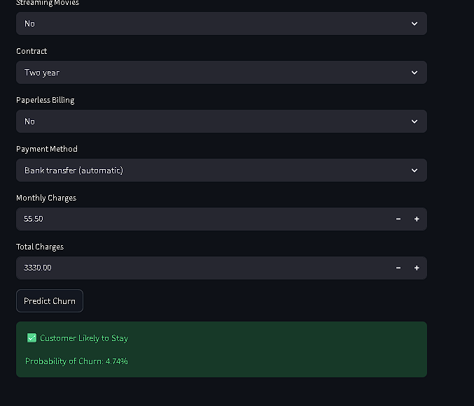

# 📊 Telecom Customer Churn Prediction & Business Intelligence System

An End-to-End Data Analytics and Machine Learning Project built using **Python, SQL, XGBoost, Power BI, and Streamlit** to predict customer churn, analyze business trends, and generate actionable insights for customer retention.

---

## 🚀 Project Overview

Customer churn is one of the most critical business challenges in the telecom industry. This project helps identify customers who are likely to leave the company and provides business insights through data analysis, machine learning, and interactive dashboards.

### Objectives

- Predict customer churn using Machine Learning.
- Analyze churn behavior using SQL.
- Build interactive Power BI dashboards.
- Generate business insights and recommendations.
- Deploy a real-time prediction application using Streamlit.

---

## 🛠️ Tech Stack

### Programming & Analysis
- Python
- Pandas
- NumPy

### Machine Learning
- Scikit-Learn
- XGBoost
- GridSearchCV

### Database & Querying
- SQL
- PostgreSQL

### Data Visualization
- Power BI
- Matplotlib
- Seaborn

### Deployment
- Streamlit

### Version Control
- Git & GitHub

---

## 📂 Dataset Information

**Dataset:** Telco Customer Churn Dataset

**Total Records:** 7,043 Customers

### Features

#### Customer Information
- gender
- SeniorCitizen
- Partner
- Dependents

#### Service Information
- PhoneService
- MultipleLines
- InternetService
- OnlineSecurity
- OnlineBackup
- DeviceProtection
- TechSupport
- StreamingTV
- StreamingMovies

#### Account Information
- tenure
- Contract
- PaperlessBilling
- PaymentMethod
- MonthlyCharges
- TotalCharges

#### Target Variable
- Churn

---

## 🔄 Project Workflow

```text
Data Collection
      ↓
Data Cleaning
      ↓
Exploratory Data Analysis
      ↓
Feature Engineering
      ↓
Data Preprocessing
      ↓
Machine Learning Modeling
      ↓
Hyperparameter Tuning
      ↓
SQL Business Analysis
      ↓
Power BI Dashboard
      ↓
Streamlit Deployment
```

---

## 🧹 Data Preprocessing

The following preprocessing steps were applied:

- Missing Value Handling
- Data Type Corrections
- One-Hot Encoding
- Feature Scaling using StandardScaler
- ColumnTransformer Pipeline
- Class Imbalance Handling using scale_pos_weight
- Train-Test Split

---

## 🤖 Machine Learning Models

### Baseline Model
- Logistic Regression

### Advanced Model
- XGBoost Classifier

---

## ⚙️ Hyperparameter Tuning

GridSearchCV was used to optimize the XGBoost model.

### Best Parameters

```python
learning_rate = 0.01
max_depth = 3
n_estimators = 500
```

### Best ROC-AUC Score

```text
84.91%
```

---

## 📈 Model Comparison

| Model | Accuracy | ROC-AUC |
|---------|---------|---------|
| Logistic Regression | 74.0% | 84.56% |
| Tuned XGBoost | 74.3% | 84.91% |

### Final Selected Model
✅ Tuned XGBoost Classifier

---

## 🎯 Final Model Performance

| Metric | Score |
|----------|----------|
| Accuracy | 74.3% |
| Precision | 51% |
| Recall | 82% |
| F1 Score | 63% |
| ROC-AUC | 84.91% |

### Why Recall Matters

Customer churn prediction is an imbalanced classification problem.

The final model achieved:

```text
Recall = 82%
```

Meaning the model successfully identifies **82% of customers likely to churn**, helping businesses proactively retain customers.

---

## 🗄️ SQL Business Analysis

Business analysis was performed using SQL to identify customer behavior patterns and churn drivers.

### Key SQL Analyses

- Overall Churn Rate Analysis
- Churn by Contract Type
- Churn by Payment Method
- Churn by Internet Service
- Revenue Analysis
- Customer Segmentation
- High-Risk Customer Identification

---

## 📊 Power BI Dashboard

An interactive Power BI dashboard was developed to visualize customer behavior and churn trends.

### Dashboard Features

- Total Customers KPI
- Churned Customers KPI
- Churn Rate KPI
- Retention Rate KPI
- Revenue Analysis
- Churn Distribution
- Contract Analysis
- Payment Method Analysis
- Internet Service Analysis
- Tenure Analysis
- Dynamic Filters

### Dashboard Preview


---

## 💻 Streamlit Web Application

A Streamlit application was developed for real-time customer churn prediction.

### Features

- User-Friendly Interface
- Customer Data Input Form
- Real-Time Prediction
- Churn Probability Estimation
- Business-Friendly Output

### Application Screenshots

#### Customer Input Form


#### Prediction Interface


#### Prediction Result



---

## 🔍 Key Business Insights

- Overall Churn Rate: 26.54%
- Retention Rate: 73.46%
- Month-to-Month customers have the highest churn.
- Electronic Check users show the highest churn.
- Fiber Optic customers churn more frequently than DSL customers.
- Long-term contracts significantly improve customer retention.
- High-risk customers were successfully identified using machine learning.

---

## 💡 Business Recommendations

### Contract Strategy
- Encourage customers to switch from Month-to-Month plans to long-term contracts.

### Customer Retention
- Create targeted retention campaigns for high-risk customers.

### Service Improvement
- Improve customer experience for Fiber Optic users.

### Payment Strategy
- Provide incentives for customers using Electronic Check payment methods.

### Loyalty Programs
- Offer rewards and discounts for long-term customers.

---

## 📁 Repository Structure

```text
telecom-customer-churn-prediction-system/

├── Dashboard/
│   └── Telecome_Customer_churn_Dashboard.pbix

├── Data/
│   └── Telco-Customer-Churn.csv

├── Model/
│   └── best_xgb_model.pkl

├── Notebooks/
│   └── churn_prediction.ipynb

├── SQL/
│   └── churn_analysis.sql

├── Screenshots/
│   ├── dashboard.png
│   ├── streamlit_app_1.png
│   ├── streamlit_app_2.png
│   └── streamlit_app_3.png

├── app.py
├── requirements.txt
└── README.md
```

---

## 🔮 Future Improvements

- Cloud Deployment
- Real-Time Prediction API
- Automated Model Retraining
- Customer Segmentation Module
- Advanced Ensemble Learning Models

---

## 👨‍💻 Author

### Vansh Gupta

B.Tech (Electronics & Communication Engineering)

Aspiring Data Analyst | Data Scientist | Machine Learning Enthusiast

GitHub: https://github.com/BuildWithVansh

LinkedIn: Add Your LinkedIn Profile Here

---

## ⭐ Project Highlights

✅ End-to-End Data Analytics Project

✅ SQL-Based Business Analysis

✅ Machine Learning Prediction System

✅ Hyperparameter-Tuned XGBoost Model

✅ 84.91% ROC-AUC Score

✅ Interactive Power BI Dashboard

✅ Streamlit Deployment

✅ Real-World Telecom Business Use Case

---

### If you found this project useful, don't forget to ⭐ the repository.
